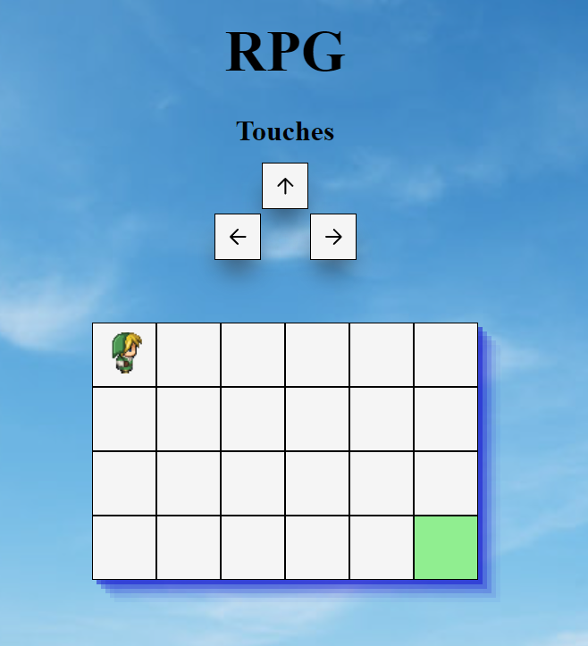

# Jeu-RPG

## Objet

Ce repo présente un petit jeu de rôle réalisée dans un but d'apprentissage et de démonstration de compétences.

## Contexte

Ce projet permet de mettre en avant l'utilisation des algorithmes sous JavaScript vanilla et a été réalisé seul. Ce projet a été réalisé en mars 2023.

## Fonctionnalités

Cette application permet de déplacer un personnage avec les touches directionnelles de son point de départ vers son points d'arrivée.

## Technologie

- HTML
- CSS
- JavaScript

## Aperçu

## Utilisation

Pour utiliser l'application :

- Télécharger le repo grâce à "git clone".
- Ouvrir le fichier "index.html" dans un navigateur web.
- Déplacer le personnage avec les touches directionnelles.
